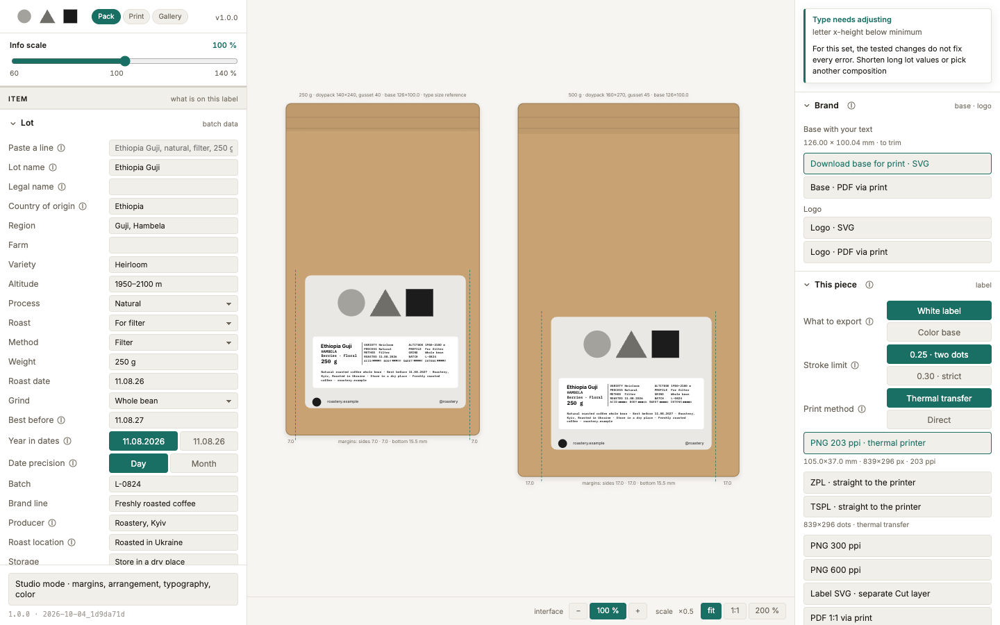

  

<h1 align="center">Pack Label</h1>

  One label per coffee lot, checked and ready for print 
  one HTML file · works offline · no install · free and open source

  <a href="https://robvagin.github.io/pack-label/"><b>Open Pack Label</b></a> ·
  <a href="#run-it">Run it</a> ·
  <a href="#how-printing-works">How printing works</a> ·
  <a href="#more-tools">More tools</a>

---

A small roastery prints two things. A **base**: a color sticker printed once, in a large run, at a print shop. And a **white label** for every lot: origin, process, roast date, best before, batch, printed in-house on a thermal printer or on A4 sticker sheets. Pack Label is the tool for the second one. You type the lot, it sets the type, checks it against the law and the printer, and gives you files the printer can take as they are.

## What it does

- **Quick lot entry:** paste one line like `Ethiopia Guji, natural, filter, berries, florals, 250 g, 11.08.26, L-0824` and it sorts the words into fields; or fill about twenty fields by hand
- **Six compositions:** register, card, axis, edge, modules and ribbon, all on your live data; the gallery shows every one side by side, and each tile says whether it fits and by how much it does not
- **Eighteen blocks** you switch on and off, with a live budget: how many millimeters are left, which blocks the law requires
- **Checks that explain themselves:** legal completeness, x-height of letters, stroke thickness against the print head, the ℮ mark, fit on the pack and on the base. When something fails, it searches for a fix and offers it
- **Real print stock:** 41 die-cut sheet specs (A4, from two vendors) and a thermal roll; the printer margin, cells that fall outside it, corner radius
- **Two packs on screen,** 250 g and 500 g doypacks in kraft, white, matte black or silver, so you see the label where it will live
- **Type for small sizes:** six embedded typefaces with measured stems, three monospaced families for data, a seeded randomizer with undo, a client mode that hides the styling
- **Proof views:** a flow grid with bleed and safe zones, and a print proof at 100, 60 and 35 % plus an inverted copy
- **Config as a file:** save the whole state as JSON, open it again, start clean

## Exports

| For | Files |
|---|---|
| Thermal printer, 203 dpi | 1-bit PNG at the exact dot size, ZPL and TSPL files you can send straight to the printer |
| Laser printer | A4 sheet as SVG, or PNG at 300 ppi, laid out on the chosen sheet spec |
| Print shop | SVG with CMYK color styles, bleed and a separate Cut layer; PDF at 1:1 |
| Anything else | PNG at 300 and 600 ppi |

File names carry the size and the lot: `label-105x37-ethiopia-guji-203ppi-1bit.png`.

## Run it

Open [robvagin.github.io/pack-label](https://robvagin.github.io/pack-label/), or download `index.html` and open it from your disk. It is the whole tool: no build step, no dependencies, no network. Your last lot stays in the browser.

Keys: **1** pack, **2** print, **3** gallery · **G** flow grid · **P** print proof · **← →** compositions · **F** typeface · **S** client or studio mode · **R** random styling, **Z** back · **0** fit · **H** hide the panels.

## How printing works

The label is drawn in millimeters, and every check is a measurement, not a guess. A 203 dpi thermal head prints dots of 0.125 mm, so a stroke thinner than two dots disappears, and the tool sets the smallest type size from the stroke of the chosen weight. The x-height of the smallest legal text must be at least 1.2 mm on a pack this size, as EU Regulation 1169/2011 sets it; the rest of the legal checks follow the Ukrainian food labeling law that the tool was first built for. Check the rules where you sell.

The sample lot opens with a type warning and the label exports locked: with all its blocks on a 105×37 mm label, the letters come out below the legal x-height, and the tool will not print them small until the lot fits.

The base in this version is a placeholder: a grey plate with a circle, a triangle and a square. Its contact lines are editable. To use your own base, replace the `BASE` object in `index.html` with your vector, cut line and bleed.

## Made by a designer

I'm a designer. I built this for a coffee roastery with AI agents and then opened it: I made the decisions, Claude Code wrote the code.

Take it if you want it.

## More tools

- [Particle Dance](https://github.com/robvagin/particle-dance) · particles that dance along patterns and 3D forms
- [Murmur](https://github.com/robvagin/murmur-vj) · a VJ visualizer: circles, triangles and squares that move to your music
- [Orbital](https://github.com/robvagin/orbital) · data as orbits, axes or a bending mesh
- [Metaballs](https://github.com/robvagin/metaballs) · soft masses that merge, split and leave holes
- [Halftone Cloud](https://github.com/robvagin/halftone-cloud) · images rebuilt as a halftone of flying shapes
- [Logomachine](https://github.com/robvagin/logomachine) · seeded generative marks: one seed, one pattern, always
- [Motion Primer](https://github.com/robvagin/motion-primer) · bodies with behaviors: swarm, pack, magnet, orbit, fall, scatter
- [Particles 3D](https://github.com/robvagin/particles-3d) · a WebGL2 cloud of up to 300,000 particles
- [Orb Atom](https://github.com/robvagin/orb-atom) · glass orbs that think: lenses with soft bodies drifting inside
- [Ellipse Sphere](https://github.com/robvagin/ellipse-sphere) · a sphere built from stacked discs that fan open and assemble
- [Thinking Sphere](https://github.com/robvagin/thinking-sphere) · a glass sphere with soft shapes drifting inside
- [SphereGen](https://github.com/robvagin/spheregen) · a glass sphere that bends whatever is behind it: generative scenes, photos, video
- [Line Engine](https://github.com/robvagin/line-engine) · engraved line patterns: superformulas, rosettes, waves and Lissajous, in motion
- [XYZ Cube](https://github.com/robvagin/xyz-cube) · your data as points in a 3D cube on axes you name
- [Hexbin](https://github.com/robvagin/hexbin) · a point cloud counted into 3D hexagon towers
- [Chart 3D](https://github.com/robvagin/chart-3d) · pie, bars, polar and area charts in 3D, with an entrance
- [Sunburst](https://github.com/robvagin/sunburst) · a hierarchy as a 3D sunburst with height
- [Voronoi](https://github.com/robvagin/voronoi) · points that share space as cells, inside any shape
- [Image Shuffler](https://github.com/robvagin/image-shuffler) · your screens flying in 3D, ready to record as a video
- [Motion Pad](https://github.com/robvagin/motion-pad) · one pad for the character of motion

## License

Code: [MIT](LICENSE) © 2026 Robert Vagin. Fonts are embedded under the [SIL Open Font License 1.1](fonts/) with their own names, as the license asks for modified copies: Pack Grotesk (from IBM Plex Sans), Pack Sans (from Source Sans 3), Pack Mono (from JetBrains Mono), Pack Mono Slab (from IBM Plex Mono), Pack Mono Narrow (from Iosevka), and Inter. Their licenses are in [`fonts/`](fonts/).
